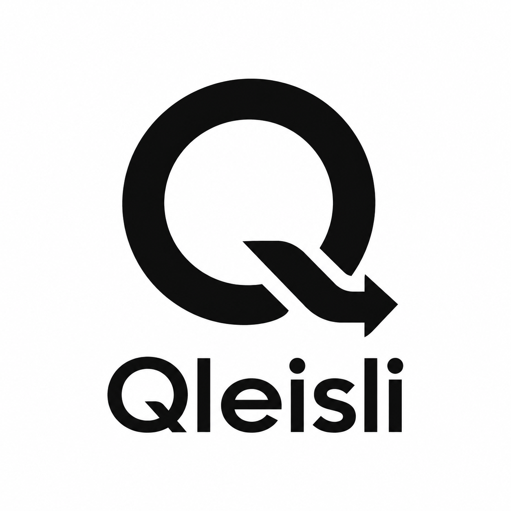
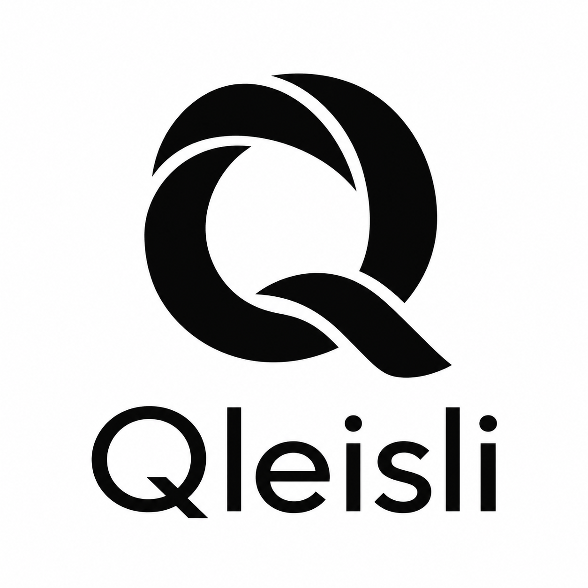
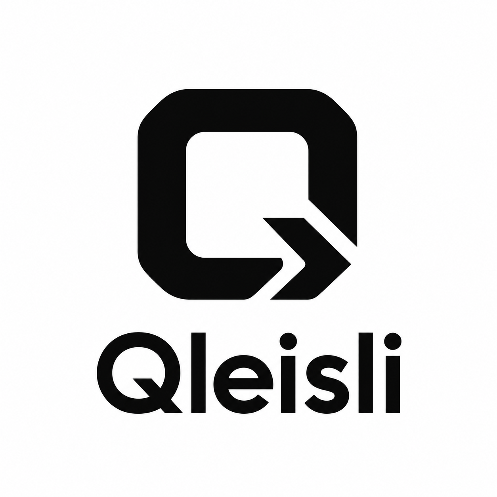

# Qleisli logo concepts for v0.4.0

These three AI-generated concepts are preserved for the v0.4.0 design discussion.
The originals come from
[commit `7778706`](https://github.com/MGYamada/Qleisli/commit/7778706bc12b20d8ae1ebdf6525f6e9fee7a35a5)
on `design/logo-concepts-v0.4.0`, authored by Masahiko G. Yamada on 2026-10-01.
The PNG files retain their original bytes and names. Logo selection belongs in
the project's [GitHub Discussions](https://github.com/MGYamada/Qleisli/discussions).

| Composition Q | Interwoven Q | Angular Q |
| --- | --- | --- |
|  |  |  |

Copyright 2026 Masahiko G. Yamada. Distributed under the project's
[Apache-2.0 license](../../../LICENSE).
