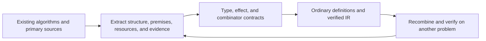

# Second development goal: structuring quantum algorithms

Extract reusable structures from real quantum programs, then evaluate their types, meanings, capabilities and evidence in executable source. The declared finite v0.1 profile is implemented and checked; general v1 is unmet. [Design](design-philosophy.md), [milestones](release-milestones.md) and [corpus](../corpus/README.md) fix the boundary. Tables describe concepts and candidate APIs, not adopted new syntax.

## Release targets and criteria for algorithm structure

V1 requires actual textbook-structured Shor, QPE and Grover with shared components and V1-C1–C5. Fix logical meaning, phase, encodings, ownership, access, scratch and resource scope before comparing implementations. Generalized syntax and controlled access cannot be inferred from a mathematical unitary.

| Target | Acceptance condition | Current state |
| --- | --- | --- |
| v0.1 | Connect finite exact semantic contracts and independent certificate checking to actual IR, ownership, and auxiliary release. Exchange multiple implementations of the same logical contract in the same client, including control and reference systems. | **Achieved for the declared finite profile.** Exact checking, computed auxiliaries, public function evidence, final-IR retention, and implementation substitution in unchanged clients are implemented and checked. This does not include a general formal proof of Rust correctness. |
| v1 | Assemble Shor, QPE, and Grover from components with explicit sizes, operation capabilities, precision, and failure conditions, with their structure readable in real source. | **Unimplemented and not achieved.** Two-bit Grover, QPE2/3, and N=15 order finding remain fixed-width regressions. |

| Algorithm | Structure that must be readable in real source | Contracts and conditions to expose |
| --- | --- | --- |
| Shor | Base selection and classical checks; controlled powers of reversible modular arithmetic; order finding through shared QPE; continued-fraction reconstruction; validation of factor candidates and retries. | Integer/register sizes, arithmetic action on the entire space, precision, failure reasons, and host retry conditions and budgets. |
| QPE | Phase-register preparation; controlled powers of the same logical operation; inverse QFT; measurement and phase interpretation. | Phase-preserving operation and control capability, sizes, bit order, precision/approximation error/failure probability, and the post-measurement target and reference system for general inputs. |
| Grover | Preparation; a phase oracle derived from a predicate; reflection about the prepared state; an iteration policy; measurement and result validation. | Search size, preparation and inverse capabilities, phase, assumptions about marked count or initial success probability, iteration count, success conditions, and failure handling. |

## Connecting research to language design

The historical C01–C20 [research inventory](https://github.com/MGYamada/Qleisli/blob/7bfcd36916199b05d5ab11851d38d53375ccf71e/docs/algorithm-corpus.md) classifies algorithms, foundations and protocols. It is design analysis, not twenty supported algorithms. Query access, synthesis, preparation, measurement and classical work need distinct cost accounts.

## Common structures to extract

S1–S8 guide extraction. Full-space contracts, reference preservation and actual provider access remain necessary; names alone do not discharge them.

| ID | Common structure | Main uses | Contract considerations |
| --- | --- | --- | --- |
| S1 | State preparation and basis changes | BV, Grover, QPE, VQE | Distinguish fresh `Iso` preparation from a `Unitary` on the same space. An inverse needs a unitary extension or appropriate domain evidence. |
| S2 | Reversible computation and compute/use/uncompute | Shor, oracles, LCU, QEC | Total basis functions, workspace, and zero return for every input/reference. Distinguish duplication of basis functions from duplication of resources. |
| S3 | Phase oracles and reflections | Grover, amplitude amplification/estimation, quantum walks | Fix signs such as `O_f=I-2Π_f` and `R_ψ=2\|ψ⟩⟨ψ\|-I`. Do not identify `R` and `-R` before adding control. |
| S4 | Controlled powers and Fourier transforms | QPE, Shor, quantum counting, HHL | Static construction of `controlled(U^(2^k))`, separate control/target ownership, bit order, phases, angles, and approximation error. |
| S5 | Finite repetition and layer composition | Grover, QAOA, product formulas, QSVT | Finite counts and the same input/output interface. Separate copyable operation descriptions from ownership consumed on every application. |
| S6 | Observables, measurement plans, and estimation | VQE, QAOA, classical shadows | `Observe`, freshly prepared resources for every trial, measurement bases, and statistical error. An expectation value is not a single measurement result. |
| S7 | Syndromes and classical feedback | QEC, teleportation | Consume measured targets and apply conditional operations to the remaining system. Code-space and error-model premises require separate evidence. |
| S8 | Block encoding and signal transformation | LCU, qubitization, QSVT, linear algebra | Contracts for normalization, projected subspaces, and errors. Do not extract the success block alone as an unconditional pure operation. |

## Design contracts for types and composition

This is design metanotation. Current finite forms are specified in [static operations](static-operations.md) and ordinary components in [routine contracts](algorithm-routines.md). Adaptive composition sums hidden histories; arbitrary free-vector bind is not adopted.

| Candidate and classification | Input/output, ownership, and effect | Acceptance/rejection conditions and IR direction |
| --- | --- | --- |
| `compose`, `tensor`: composition principles for ordinary definitions | From `U:A⇒B, V:B⇒C`, obtain `V∘U:A⇒C`. Tensor takes distinct owned resources. Effects take their join. | Accept passing one output into the next input. Reject giving the same resource to both factors. Currently lower through ordinary function expansion and wire joins/splits. |
| `adjoint`: finite language form implemented | The general proposal maps `Unitary<A,B>` to `Unitary<B,A>`. The implementation supports a single same-type `Q<A> -> Q<A>` interface. | Reverse the order and operations of a statically resolved body and reverify `ApplyUnitary`. Reject measurement, `Iso`, and classical arguments. |
| `controlled`: finite implementation as `qif` | A `Unitary` consumes control `Q<Bit>` and target `Q<A>` and returns both. | Branches name statically resolved functions with matching input/output type; lower to phase-preserving `ApplyUnitary`. Reject aliasing and `Observe`. |
| `repeat_static`: finite language form implemented | The same-interface `U:A⇒A` and a static natural `n` give `U^n`. | Expand 0–4,096 repetitions within a budget. Check the target even for `n=0`. Reject dynamic counts, resource duplication, and capacity overflow. |
| `conjugate`, `reflect`: candidate ordinary definitions built from the forms above | `U†VU`, `A(2\|0⟩⟨0\|-I)A†`. The reflection's `A` is a unitary on the same space. | Accept a contract including inverse and phase. Reject treating the inverse of `init0` as unconditional release. Expand the composition into ordinary IR sequences and reverify. |
| `instrument`: composition principle for observation effects | A completely positive map `E_b` for each classical output `b`, with a trace-preserving sum over all branches. | Accept retaining all outcomes or marginalizing them classically. Reject postselection that hides failure branches. Represent through measurement and classical-branch IR. |
| `estimate`: candidate host measurement plan | From a preparation procedure and observable, obtain repeated classical samples and error information. | Accept fresh preparation for every trial and explicit aggregation. Reject copying an owned unknown state to increase the trial count. At present, plan on the host and submit each trial to verified IR. |
| `block_encode`: candidate evidence-bearing contract | A specified block of a unitary `U` represents `A/α` within error `ε`. | Accept evidence for `α`, subspaces, and error, with a full unitary. Reject using nonunitary `A` directly as a gate. The evidence schema and IR are not yet designed. |

## Implementation order and acceptance criteria

A0–A4 are work areas, not release numbers. Write desired source and counterexamples, specify a bounded contract/checking experiment, then implement and validate. Promote only with multiple clients, explicit evidence and actual IR correspondence. Keep generalized algorithms and the three theorem pillars open.

| Area | Acceptance criteria | State |
| --- | --- | --- |
| A0: corpus and contracts | Track sources, input models, structures, and unsupported parts for 20 entries; organize shared structures and type contracts. | Initial organization complete. |
| A1: reuse of finite components | Bundle ordinary `.qli` components and assemble Grover, BV, and bit-flip correction. Check all targets, iteration counts, phase-sensitive inputs, reference correlations, and rejection cases. | Five components and three examples implemented and validated on finite cases. |
| A2: exposing operation structure | Specify surface rules for `adjoint`, control, and finite repetition. Implement QPE with exact phase and bit order; compare reflection signs under control. | [Reached for a finite subset](static-operations.md): ordinary QFT2/3 and QPE2/3, with 12 static-operation tests. General sizes, angles, and operation arguments remain open. |
| A3: arithmetic and hybrid computation | Implement reversible arithmetic and small Shor, plus VQE/QAOA through parameterized preparation, observables, and host iteration. State input-preparation and synthesis costs. | [Initial finite-arithmetic milestone](https://github.com/MGYamada/Qleisli/blob/7bfcd36916199b05d5ab11851d38d53375ccf71e/docs/arithmetic-order-finding.md): N=15 order finding and classical factor extraction checked. General sizes and VQE/QAOA remain open. |
| A4: evidence and recombination | Develop contracts for general preservation effects, code spaces, block encoding, and approximation error. Recombine components on problems not used for extraction and validate performance and success conditions. | Finite exact v0.1 checking, computed forms, public function-contract reuse, and final-IR evidence retention implemented and checked. Generalization is unimplemented. |
