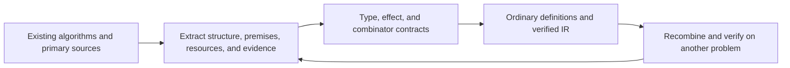

# Second development goal: structuring quantum algorithms

Status: **finite building blocks implemented and validated; the v0.1 minimum
and the v1 target selected** (2026-09-27). The declared finite v0.1 profile
has been implemented and checked; v1 has not been achieved. The first goal,
[a quantum language for the AI era](ai-era-goal.md), defines the verification
trust boundary. This goal determines the building blocks from which the
programs being verified are assembled. It follows the
[design principles](design-philosophy.md) and [finite core](formal-core.md).
This English edition supersedes the earlier Japanese design plan without
changing its decisions or evidence status. [Release milestones](release-milestones.md)
remain authoritative for release criteria; this plan does not itself add
language forms or standard APIs.

**Project north star:** make the language people use to think about quantum
algorithms coincide with the language they use to write programs. The second goal is
to develop the concepts, compositions, and premises that appear in that thinking
into abstractions that can actually compile. Shor, QPE, and Grover are the three
concrete targets for evaluating that direction in v1.

**Current priority (2026-09-27):** make evidence-bearing semantic contracts
`U E_in = E_out u` and independent certificate checking the
[v0.1 minimum](release-milestones.md#v01-minimum-semantic-contracts). Develop the
finite-core specification, ownership rules, and IR correspondence as their
foundation, retaining existing finite v0 examples as regressions. The finite
checker and three-argument computed form have been
[implemented](semantic-contracts-v0.1.md) and connected to
[public function contracts and evidence retention through final IR](function-contracts-v0.1.md).
General sizes and operation parameters are subsequent work toward the
[concrete v1 criteria](release-milestones.md#v1-north-star-textbook-algorithm-structure),
built on this correspondence between meaning and implementation.

**Pre-0.2.0 prerequisite (adopted 2026-09-27):**
[write imaginary Qleisli 1.0 code first](release-milestones.md#pre-v020-imaginary-v1-code)
before implementing that generalization. Collect initial ideal-code drafts for
QPE, Grover, amplitude estimation, Shor, quantum walk, and QSVT, and record
their semantic contracts, capabilities, and open questions before new-feature
implementation and release work for 0.2.0. The drafts need not compile and may
be revised. The [six drafts and requirements index](imaginary-v1/README.md)
and [semantic review](imaginary-v1/review.md) now exist, satisfying the
prerequisite of initial bodies and requirement records. This was not achieved
merely by the earlier research corpus or fixed-width examples; implementation
and validation of the imaginary code remain incomplete.

> Extract common structures from representative quantum algorithms and express
> their types, ownership, effects, and evidence as Qleisli abstractions. Evaluate
> those abstractions by describing and verifying existing algorithms, then
> explore new algorithms by recombining them.

The [third-layer plan](stdlib-roadmap.md) defines how the extracted structures
will be adopted, distributed, and maintained as standard vocabulary. A0–A4 in
this goal concern discovery and evaluation of structures; L0–L5 in the third
layer concern the contract ledger and library development. Implementation of
generalized APIs remains future work.

## Release targets and criteria for algorithm structure

**The concrete v1 criterion for evaluating the north star is that real Shor,
QPE, and Grover source reads in the structure of the textbook algorithms.**
From each algorithm's entry point, readers must be able to follow the relation
between preparation, logical operations, repetition, observation, and classical
postprocessing. Merely assigning function names to gate sequences, or writing
unimplemented pseudocode, does not meet this criterion.

| Target | Acceptance condition | Current state |
| --- | --- | --- |
| v0.1 | Connect finite exact semantic contracts and independent certificate checking to actual IR, ownership, and auxiliary release. Exchange multiple implementations of the same logical contract in the same client, including control and reference systems. | **Achieved for the declared finite profile.** Exact checking, computed auxiliaries, public function evidence, final-IR retention, and implementation substitution in unchanged clients are implemented and checked. This does not include a general formal proof of Rust correctness. |
| v1 | Assemble Shor, QPE, and Grover from components with explicit sizes, operation capabilities, precision, and failure conditions, with their structure readable in real source. | **Unimplemented and not achieved.** Two-bit Grover, QPE2/3, and N=15 order finding remain fixed-width regressions. |

For v0.1, fix the logical action `u` and isometric encodings `E_in/E_out`
first, and check global phase, type trees, bit order, input/output layouts,
and evidence that the input has the required encoding. The independent checker
binds a certificate to its target IR and contract version while retaining
ordinary type, ownership, effect, and complete-output-coverage checks.
Approximate numerical agreement or small auxiliary leakage is not evidence
of an exact equality or pure release.

The minimal acceptance cases are substitution between compute/phase/uncompute
and direct implementations of the same phase-oracle contract, an auxiliary
H;H identity, and simultaneous X on data and auxiliary for `f(x)=x`.
Relative phase under control and extension to arbitrary reference systems are
part of the contract. Rejection cases include X on the auxiliary alone,
incorrect phases/predicates/encodings/layouts, evidence left over after its
target circuit changes, and release without zero return. H;H and simultaneous
X use the new three-argument `with_computed(q,f,u)` to check the exact relation.
The original two-argument form remains restricted to Z/T sequences. Distinguish
the [current validation scope](specification-status.md) from the complete
release criteria.

For v1, expose the following structures and conditions. Terms in this table
are design concepts, not finalized API names or new syntax.

| Algorithm | Structure that must be readable in real source | Contracts and conditions to expose |
| --- | --- | --- |
| Shor | Base selection and classical checks; controlled powers of reversible modular arithmetic; order finding through shared QPE; continued-fraction reconstruction; validation of factor candidates and retries. | Integer/register sizes, arithmetic action on the entire space, precision, failure reasons, and host retry conditions and budgets. |
| QPE | Phase-register preparation; controlled powers of the same logical operation; inverse QFT; measurement and phase interpretation. | Phase-preserving operation and control capability, sizes, bit order, precision/approximation error/failure probability, and the post-measurement target and reference system for general inputs. |
| Grover | Preparation; a phase oracle derived from a predicate; reflection about the prepared state; an iteration policy; measurement and result validation. | Search size, preparation and inverse capabilities, phase, assumptions about marked count or initial success probability, iteration count, success conditions, and failure handling. |

Individual gates, auxiliary-register wiring, and physical placement belong
inside component implementations with contracts for meaning, ownership,
evidence, and cost. This does not permit hiding the sizes, operation
capabilities, errors, failures, or host boundary that a client needs. Maintain
checking between ordinary definitions and actual IR. Do not confuse v1
readability with a soundness proof for the whole implementation or a hardware
performance guarantee.

## Connecting research to language design

The initial corpus contains [20 entries](algorithm-corpus.md), distinguishing
algorithms, derived methods, foundations, error correction, and communication
protocols. Each entry records its input model, structure, required evidence,
and differences from the current core. Investigate whether the same components
appear for different purposes, rather than merely collecting algorithm names.

1. Record the paper's inputs/outputs, oracles, success/failure, classical
   processing, and precision.
2. Decompose circuits into preparation, reversible computation, control,
   reflection, repetition, measurement, and adaptive processing.
3. Give shared parts contracts for **meaning including operator phase, linear
   ownership, effects, and additional evidence**.
4. Implement what the current syntax can express as ordinary `.qli` definitions.
   Propose a new language form only after identifying the structure or
   verification information lost by ordinary definitions.
5. Compare independent IR verification with finite mathematical examples and
   rejection cases. Apply the result to problems not used in its extraction,
   and assess whether they can be expressed without additional primitives.

Distinguish oracle query counts, reversible-circuit synthesis cost, state
preparation, measurement counts, and classical postprocessing. The current
finite truth tables are not efficient implementations of general large oracles.
Successful type checking does not replace a proof of an algorithm's success
probability or speedup.

## Common structures to extract

The following is **Qleisli's design analysis** of the corpus. It does not
assert that the papers proposed or proved Qleisli's abstractions.

| ID | Common structure | Main uses | Contract considerations |
| --- | --- | --- | --- |
| S1 | State preparation and basis changes | BV, Grover, QPE, VQE | Distinguish fresh `Iso` preparation from a `Unitary` on the same space. An inverse needs a unitary extension or appropriate domain evidence. |
| S2 | Reversible computation and compute/use/uncompute | Shor, oracles, LCU, QEC | Total basis functions, workspace, and zero return for every input/reference. Distinguish duplication of basis functions from duplication of resources. |
| S3 | Phase oracles and reflections | Grover, amplitude amplification/estimation, quantum walks | Fix signs such as `O_f=I-2Π_f` and `R_ψ=2\|ψ⟩⟨ψ\|-I`. Do not identify `R` and `-R` before adding control. |
| S4 | Controlled powers and Fourier transforms | QPE, Shor, quantum counting, HHL | Static construction of `controlled(U^(2^k))`, separate control/target ownership, bit order, phases, angles, and approximation error. |
| S5 | Finite repetition and layer composition | Grover, QAOA, product formulas, QSVT | Finite counts and the same input/output interface. Separate copyable operation descriptions from ownership consumed on every application. |
| S6 | Observables, measurement plans, and estimation | VQE, QAOA, classical shadows | `Observe`, freshly prepared resources for every trial, measurement bases, and statistical error. An expectation value is not a single measurement result. |
| S7 | Syndromes and classical feedback | QEC, teleportation | Consume measured targets and apply conditional operations to the remaining system. Code-space and error-model premises require separate evidence. |
| S8 | Block encoding and signal transformation | LCU, qubitization, QSVT, linear algebra | Contracts for normalization, projected subspaces, and errors. Do not extract the success block alone as an unconditional pure operation. |

## Design contracts for types and composition

Notation such as `U:A⇒B` in this section is **design metanotation**, not new
`.qli` syntax or first-class operation values. The implemented interfaces are
recorded separately in the [building-block contracts](algorithm-routines.md).

| Candidate and classification | Input/output, ownership, and effect | Acceptance/rejection conditions and IR direction |
| --- | --- | --- |
| `compose`, `tensor`: composition principles for ordinary definitions | From `U:A⇒B, V:B⇒C`, obtain `V∘U:A⇒C`. Tensor takes distinct owned resources. Effects take their join. | Accept passing one output into the next input. Reject giving the same resource to both factors. Currently lower through ordinary function expansion and wire joins/splits. |
| `adjoint`: finite language form implemented | The general proposal maps `Unitary<A,B>` to `Unitary<B,A>`. The implementation supports a single same-type `Q<A> -> Q<A>` interface. | Reverse the order and operations of a statically resolved body and reverify `ApplyUnitary`. Reject measurement, `Iso`, and classical arguments. |
| `controlled`: finite implementation as `qif` | A `Unitary` consumes control `Q<Bit>` and target `Q<A>` and returns both. | Branches name statically resolved functions with matching input/output type; lower to phase-preserving `ApplyUnitary`. Reject aliasing and `Observe`. |
| `repeat_static`: finite language form implemented | The same-interface `U:A⇒A` and a static natural `n` give `U^n`. | Expand 0–4,096 repetitions within a budget. Check the target even for `n=0`. Reject dynamic counts, resource duplication, and capacity overflow. |
| `conjugate`, `reflect`: candidate ordinary definitions built from the forms above | `U†VU`, `A(2\|0⟩⟨0\|-I)A†`. The reflection's `A` is a unitary on the same space. | Accept a contract including inverse and phase. Reject treating the inverse of `init0` as unconditional release. Expand the composition into ordinary IR sequences and reverify. |
| `instrument`: composition principle for observation effects | A completely positive map `E_b` for each classical output `b`, with a trace-preserving sum over all branches. | Accept retaining all outcomes or marginalizing them classically. Reject postselection that hides failure branches. Represent through measurement and classical-branch IR. |
| `estimate`: candidate host measurement plan | From a preparation procedure and observable, obtain repeated classical samples and error information. | Accept fresh preparation for every trial and explicit aggregation. Reject copying an owned unknown state to increase the trial count. At present, plan on the host and submit each trial to verified IR. |
| `block_encode`: candidate evidence-bearing contract | A specified block of a unitary `U` represents `A/α` within error `ε`. | Accept evidence for `α`, subspaces, and error, with a full unitary. Reject using nonunitary `A` directly as a gate. The evidence schema and IR are not yet designed. |

`Q<A>` remains a linear ownership type. Treat computation composition as a
Kleisli-like principle tracking classical context `Γ`, quantum resources
`Δin/Δout`, and effects. For composition with measurement, a branch hiding the
internal result `c` is `Σ_c F_(d|c)∘E_c`. Describing this as a strict monad
would require separate proofs of the objects, equations, units, associativity,
and consistency of resource indices. This work introduces neither arbitrary
`bind` from the free vector space nor a new monad API.

## Implementation order and acceptance criteria

The imaginary-code drafts and requirement records above precede
v0.2.0 generalization and new-feature implementation. Do not reinterpret the
historical milestones below as completion of those drafts. Distinguish the
order for deepening implementation/validation from the prior step of writing
the ideal-code corpus.

| Area | Acceptance criteria | State |
| --- | --- | --- |
| A0: corpus and contracts | Track sources, input models, structures, and unsupported parts for 20 entries; organize shared structures and type contracts. | Initial organization complete. |
| A1: reuse of finite components | Bundle ordinary `.qli` components and assemble Grover, BV, and bit-flip correction. Check all targets, iteration counts, phase-sensitive inputs, reference correlations, and rejection cases. | Five components and three examples implemented and validated on finite cases. |
| A2: exposing operation structure | Specify surface rules for `adjoint`, control, and finite repetition. Implement QPE with exact phase and bit order; compare reflection signs under control. | [Reached for a finite subset](static-operations.md): ordinary QFT2/3 and QPE2/3, with 12 static-operation tests. General sizes, angles, and operation arguments remain open. |
| A3: arithmetic and hybrid computation | Implement reversible arithmetic and small Shor, plus VQE/QAOA through parameterized preparation, observables, and host iteration. State input-preparation and synthesis costs. | [Initial finite-arithmetic milestone](arithmetic-order-finding.md): N=15 order finding and classical factor extraction checked. General sizes and VQE/QAOA remain open. |
| A4: evidence and recombination | Develop contracts for general preservation effects, code spaces, block encoding, and approximation error. Recombine components on problems not used for extraction and validate performance and success conditions. | Finite exact v0.1 checking, computed forms, public function-contract reuse, and final-IR evidence retention implemented and checked. Generalization is unimplemented. |

A0–A4 are work areas and existing milestones, not release numbers or a
requirement to complete every item in sequence. For v0.1, the finite evidence
checking of A4 comes first on top of A2's phase and static-operation foundation.
For v1, develop the fixed-width examples of A1–A3 into structures with size and
operation contracts. A3's VQE/QAOA and A4's general block encoding are not part
of the same acceptance condition as structuring the three target algorithms.
Continue to record their respective evidence and adoption decisions.

Promoting a component to a stable abstraction requires multiple use contexts,
acceptance/rejection cases, mathematical contracts, and correspondence to
generated IR. A claim of a new algorithm requires comparison with existing
methods and evidence for its particular correctness and complexity. The small
examples provide a foundation for that evaluation; they do not complete the
long-term goal.
