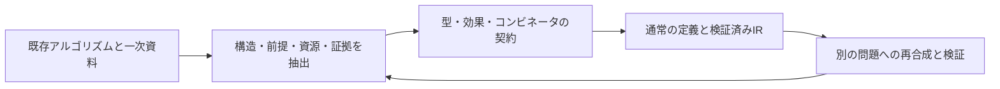

# 第2開発目標: 量子アルゴリズムの構造化

状態: **開発目標を設定・初回の抽出と有限部品を実装・検証**（2026-09-26）。長期目標は進行中。第1目標の[AI時代の量子言語](ai-era-goal.md)が検証の信頼境界を定め、本目標は検証するプログラムをどのような部品で組み立てるかを定める。[設計思想](design-philosophy.md)と[有限コア](formal-core.md)に従う。

**現在の優先順位（2026-09-26）:** [ロードマップ](../ROADMAP.md)を段階1へ戻し、有限コア仕様v0とその証明・IR対応を先に進める。本書の長期計画は維持し、サイズ付き型・操作パラメータ化・新規の算法／標準APIは後続とする。既存の有限例は仕様の回帰検査に使う。

> 代表的な量子アルゴリズムから共通構造を抽出し、その型・所有権・効果・証拠をQleisliの抽象化として表す。既存アルゴリズムの記述と検証で抽象化を評価し、その再合成から新しいアルゴリズムを探る。

[第3層の将来計画](stdlib-roadmap.md)は、ここで抽出した構造を標準語彙として採用・配布・保守する流れを定める。本目標のA0〜A4は構造の発見と評価、第三層のL0〜L5は契約台帳とライブラリの整備を担当する。一般化したAPIの実装は将来の作業とする。

## 調査を言語設計へ結び付ける方法

初期コーパスは[20項目](algorithm-corpus.md)。アルゴリズム、派生手法、基盤、誤り訂正・通信プロトコルを区別する。各項目に入力モデル、構造、必要な証拠、現行コアとの差を記録する。名称を増やすだけでなく、同じ部品が異なる目的に現れるかを調べる。

1. 論文における入力・出力、オラクル、成功・失敗、古典処理、精度を記録する。
2. 回路を準備・可逆計算・制御・反射・反復・測定・適応処理へ分解する。
3. 共通部分について、**演算子の位相を含む意味、線形所有権、効果、追加の証拠**を契約化する。
4. 現行構文で表せるものは通常の `.qli` 定義として実装する。新しい言語形式は、通常定義で失われる構造や検証情報を示してから提案する。
5. 独立したIR検証と、数学から導いた有限例・拒否例で照合する。抽出に使わなかった問題へ適用し、追加の原始操作なしで表現できるかを評価する。

オラクルの問い合わせ回数、可逆回路への合成コスト、状態準備、測定回数、古典後処理を区別する。現行の有限真理値表は一般の大規模オラクルの効率的実装ではない。型検査の成功は、アルゴリズムの成功確率や高速化の証明を代替しない。

## 抽出する共通構造

以下はコーパスからの**Qleisli側の設計上の整理**である。論文がQleisliの抽象化を提案・証明したという意味ではない。

| ID | 共通構造 | 主な利用先 | 契約上の要点 |
| --- | --- | --- | --- |
| S1 | 状態準備と基底変換 | BV、Grover、QPE、VQE | `Iso`による新規準備と、同じ空間の`Unitary`を区別。逆変換にはユニタリ拡張または適切な定義域証拠が必要。 |
| S2 | 可逆計算・計算して使い逆計算する | Shor、オラクル、LCU、QEC | 全域な基底関数、作業領域、全入力・参照系に対するゼロ復帰。基底関数の複製と資源の複製を区別。 |
| S3 | 位相オラクルと反射 | Grover、振幅増幅・推定、量子ウォーク | `O_f=I-2Π_f`、`R_ψ=2∣ψ⟩⟨ψ∣-I`など符号を固定。`R`と`-R`は制御化前に同一視しない。 |
| S4 | 制御付き冪とフーリエ変換 | QPE、Shor、量子計数、HHL | `controlled(U^(2^k))`の静的構成、制御と標的の別所有、ビット順序、位相・角度・近似誤差。 |
| S5 | 有限反復と層の合成 | Grover、QAOA、積公式、QSVT | 有限回数と同じ入出力インターフェース。コピー可能な操作記述と、毎回消費する所有権を分離。 |
| S6 | 観測量・測定計画・推定 | VQE、QAOA、古典シャドウ | `Observe`、各試行で新しく準備する資源、測定基底、統計誤差。期待値は一回の測定値ではない。 |
| S7 | シンドロームと古典フィードバック | QEC、テレポーテーション | 測定対象を消費し、残系に条件付き操作を適用。符号空間と誤りモデルは別の証拠。 |
| S8 | ブロック符号化と信号変換 | LCU、qubitization、QSVT、線形代数 | 正規化係数・射影する部分空間・誤差の契約。成功ブロックだけを無条件の純粋操作として取り出さない。 |

## 型と合成の設計契約

この節の `U:A⇒B` などは**設計用のメタ記法**であり、新しい `.qli` 構文や第一級の操作値ではない。実装済みの入口は[部品の契約](algorithm-routines.md)に分ける。

| 候補と所属 | 入出力・所有権・効果 | 受理／拒否の条件とIR方針 |
| --- | --- | --- |
| `compose`、`tensor`／通常定義の合成原理 | `U:A⇒B, V:B⇒C`から`V∘U:A⇒C`。テンソルは異なる所有資源を取る。効果は上限を取る。 | 受理: 出力を次の入力へ渡す。拒否: 同じ資源を両方の因子に渡す。現在は通常関数の展開とワイヤの合流・分割に変換。 |
| `adjoint`／有限の言語形式を実装 | 一般案は`Unitary<A,B>`から`Unitary<B,A>`。実装は単一の同型`Q<A> -> Q<A>`。 | 静的に解決した本文の順序と各演算を反転し、ApplyUnitaryを再検証する。測定、Iso、古典引数は拒否。 |
| `controlled`／`qif`として有限実装 | 制御`Q<Bit>`と標的`Q<A>`を消費し両方を返す`Unitary`。 | 静的な同型関数名を枝とし、位相を保持するApplyUnitaryへ変換。別名参照とObserveを拒否する。 |
| `repeat_static`／有限の言語形式を実装 | 同一インターフェースの`U:A⇒A`と静的自然数`n`から`U^n`。 | 0〜4,096回を予算付きで展開。`n=0`でも対象を検査する。動的回数、資源複製、上限超過を拒否。 |
| `conjugate`、`reflect`／上記形式から作る通常定義の候補 | `U†VU`、`A(2∣0⟩⟨0∣-I)A†`。反射の`A`は同じ空間のユニタリ。 | 受理: 逆演算と位相を含む契約。拒否: `init0`の逆を無条件の解放とする。構成を通常のIR列へ展開し再検証。 |
| `instrument`／観測効果の合成原理 | 各古典出力`b`の完全正写像`E_b`、全枝の和が跡保存。 | 受理: 全結果を保持または古典的に周辺化。拒否: 失敗枝を隠す事後選択。測定・古典分岐のIRで表す。 |
| `estimate`／ホスト側の測定計画の候補 | 状態準備手順と観測量から、反復した古典サンプルと誤差情報を得る。 | 受理: 各試行の新規準備と明示した集計。拒否: 所有する未知状態を複製して試行数を増やす。現時点ではホスト側で計画し、各試行を検証済みIRへ渡す。 |
| `block_encode`／証拠を持つ契約の候補 | ユニタリ`U`の指定ブロックが`A/α`を誤差`ε`内で表す。 | 受理: `α`・部分空間・誤差の証拠と全体ユニタリ。拒否: 非ユニタリな`A`を直接ゲートとする。証拠スキーマとIRは未設計。 |

`Q<A>`は引き続き線形な所有権型である。計算の合成は古典文脈`Γ`、量子資源`Δin/Δout`、効果を追うKleisli的な原理として扱う。測定を含む合成では、内部結果`c`を隠した枝は`Σ_c F_(d|c)∘E_c`となる。これを厳密なモナドとしてまとめるには、対象・等式・単位・結合則と資源の添字の整合を別に証明する。今回、自由ベクトル空間の任意の`bind`や新しいモナドAPIは導入しない。

## 実装順と到達基準

| 段階 | 到達基準 | 状態 |
| --- | --- | --- |
| A0: コーパスと契約 | 20項目の出典・入力モデル・構造・未対応部分を追跡し、共通構造と型の契約を整理する。 | 初回整理済み |
| A1: 有限部品の再利用 | 通常の`.qli`部品を同梱し、Grover・BV・ビット反転訂正を組み立てる。全対象、反復回数、位相に敏感な入力、参照系との相関、拒否例を検査する。 | 5部品と3例を実装・有限例で検証 |
| A2: 操作構造の表層化 | `adjoint`・制御・有限反復の表層規則を定める。QPEをビット順序・正確な位相付きで実装し、反射符号を制御下でも比較する。 | [有限部分集合で到達](static-operations.md)。通常定義のQFT2/3とQPE2/3、静的操作12テスト。一般サイズ・角度・操作引数は残件。 |
| A3: 算術とハイブリッド計算 | 可逆算術と小規模Shor、パラメータ付き準備・観測量・ホスト反復によるVQE/QAOAを実装する。入力準備と合成コストを明記する。 | [有限算術の初回到達](arithmetic-order-finding.md)。N=15の位数推定と古典因数抽出を検査。一般サイズとVQE/QAOAは残件。 |
| A4: 証拠と再合成 | 一般の保存効果、符号空間・ブロック符号化・近似誤差の契約を整備。抽出に使わなかった問題へ部品を再合成し、性能と成功条件を検証する。 | 未着手 |

部品を安定した抽象化に昇格させるには、複数の利用文脈、受理・拒否例、数学的な契約、生成IRとの対応を残す。新規アルゴリズムという主張には、既存手法との比較と個別の正しさ・計算量の根拠を要する。今回の小規模例はその評価基盤であり、長期目標全体の完了ではない。
