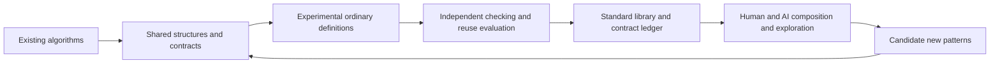

<a id="第3層の将来計画-量子アルゴリズムの標準語彙"></a>

# Layer 3 roadmap: a standard vocabulary for quantum algorithms

Status: **L0/L1 and the finite part of L3 are established; the v0.1 minimum and
v1 target are adopted; generalized standard APIs remain unimplemented**
(2026-09-27). The [contract ledger, format v1](stdlib-contracts.md), and
[finite static-operation implementation](static-operations.md) provide the
foundation. Higher-order types, algorithm-skeleton names, and generalized
module organization in this document are design candidates. The
[standard-library specification](standard-library.md) distinguishes current APIs.
This authoritative English edition of the design plan replaces its Japanese
edition without adopting its proposals as language rules or public APIs.
[Release milestones](release-milestones.md) remain authoritative for release
acceptance, and the [language evolution framework](language-evolution.md)
distinguishes current specifications from future design.

**Project north star:** make the language people use to think about quantum
algorithms coincide with the language they use to write programs. Layer 3
develops that language into a standard vocabulary with meanings, premises, and
verification status. Real source in which Shor, QPE, and Grover retain their
textbook structure is the concrete v1 acceptance target for this direction.

**Priority adopted on 2026-09-27:** make evidence-bearing semantic contracts
`U E_in = E_out u` and independent certificate checking the
[v0.1 minimum](release-milestones.md#v01-minimum-semantic-contracts). Develop
finite-core specification, ownership, and source/IR correspondence as their
foundation, first demonstrating exchangeable implementations of one logical
contract. The finite checker and three-argument computed form are
[implemented](semantic-contracts-v0.1.md), and the finite v0.1 path including
[public function contracts and final-IR evidence](function-contracts-v0.1.md)
has been checked. General sizes and operation parameters follow this foundation
to support the [v1 acceptance target](release-milestones.md#v1-north-star-textbook-algorithm-structure).
Keep current v0 and fixed-width examples as regressions; adopting a standard
API requires its own contract and validation.

Before generalization, new standard-API implementation, or release for v0.2.0,
complete the [imaginary Qleisli 1.0 code prerequisite](release-milestones.md#pre-v020-imaginary-v1-code).
The six initial ideal-code drafts need not compile; they are design material
for extracting vocabulary, contracts, and open questions. The
[six-draft requirement index](imaginary-v1/README.md) and
[semantic review](imaginary-v1/review.md) now exist. This satisfies the limited
artifact-and-requirement prerequisite; APIs written in drafts are not thereby
adopted into the standard library.

> Build a standard vocabulary from concepts used in quantum-algorithm research,
> with contracts for types, ownership, effects, meaning, evidence, and cost.
> Humans and AI should be able to compose programs from that vocabulary and
> pass them through the same verification foundation.

<a id="1-三つの層の関係"></a>

## 1. How the three layers relate

| Layer | Role | Deliverables |
| --- | --- | --- |
| Layer 1: [verification foundation](ai-era-goal.md) | Define the grounds for accepting a program. | Type/effect/ownership rules, finite core, independent IR verifier. |
| Layer 2: [algorithm structure](algorithm-structure-goal.md) | Extract reusable structures from existing algorithms. | Corpus, shared structures, experimental components, and recomposition for other problems. |
| Layer 3: standard vocabulary | Establish contracts for the extracted structures and develop a maintainable standard library. | API-to-semantics correspondence, a contract ledger with verification status, implementations, conformance checks, and version management. |

Layer 2 covers discovering and evaluating abstractions; Layer 3 covers
adoption, distribution, and maintenance. This organization is separate from
implementation stages 0–5 and does not mean that all three layers are complete.

<a id="リリース目標と台帳の役割"></a>

### Release targets and the role of the ledger

| Target | Required library and verification result | Current status |
| --- | --- | --- |
| v0.1 | Independently check fixed logical meaning, encodings, entry evidence, and phase for finite exact semantic contracts, binding certificates to actual IR and the contract version. Demonstrate that substituting implementations of one contract preserves ownership and meaning, including coherent control and references. | **Met in the declared finite profile.** Exact checker, computed regions, public function evidence, retention through final IR, and substitution are implemented and checked. Automated checking of the entire ledger and generalization remain later work. |
| v1 | Shor, QPE, and Grover retain their textbook algorithm structure in real source. Compose logical-component contracts and substitute gate, auxiliary, and layout implementations. | **Unimplemented and unmet.** Small Grover, QPE2/3, and N=15 order-finding examples are fixed-width foundations, not v1 acceptance evidence. |

In the v0.1 contract, the specification fixes `u` and isometric `E_in/E_out`.
Check type trees, phase, bit order, physical inputs/outputs, and evidence that
the input satisfies its encoding, alongside ordinary ownership, effect, and
complete-output-coverage checks. A certificate's name or presence alone cannot
justify acceptance; modifying its circuit must invalidate stale evidence.
If exact equality checking exceeds capacity, report a diagnostic rather than
using approximate agreement to authorize pure auxiliary release.

Acceptance examples include substituting a compute/phase/uncompute circuit and
a direct implementation of one phase-oracle contract, an H;H identity, and
simultaneous data/auxiliary X for `f(x)=x`. Check phase under coherent control
and extension to references. Reject auxiliary-only X, incorrect phase,
predicate, encoding or layout, mismatched evidence, and nonzero auxiliary
leakage. H;H and simultaneous X use the finite exact three-argument form;
the original two-argument form remains restricted to Z/T chains. The
[conformance record](specification-status.md) distinguishes the checked scope
from completion of general implementation substitution.

Listing unimplemented function names or pseudocode does not establish v1
structure. Follow the [algorithm-goal acceptance table](algorithm-structure-goal.md#リリース目標と構造化の判定):
connect Shor's order finding, classical reconstruction and retries; QPE's
controlled powers and inverse QFT; and Grover's preparation, phase oracle,
reflection and repetition to real source and verification. Sizes, required
control/inverse access, error/failure conditions, and host retries remain
client-visible contracts. Gate sequences, private auxiliary management, and
layout belong in component implementations and contracts. This description
does not finalize syntax or API names.



<a id="2-ライブラリの七つの領域"></a>

## 2. Seven library areas

These areas classify concepts; the names below are not a decision to add those
names to `std::`. Start with ordinary `.qli` definitions and identify any parts
requiring language forms for static operation transformations. New primitives
require their own semantics and IR checks.

| Area | Candidate standard vocabulary | Classification, dependencies, and contract focus |
| --- | --- | --- |
| Quantum primitives | Preparation, unitary operations, measurement, reset, discard | Build on sealed operations in `std::quantum` and `std::observe`; derived preparation and measurements are ordinary definitions. Do not introduce a `unitary` primitive executing arbitrary matrices. |
| Structural combinators | Control, inverse, repeat, tensor, compose, compute/uncompute | Inverse and control correspond to `adjoint` and `qif`; their finite forms already exist, while generalization remains proposed. Consider static transformations through language forms first, with composition expressed by ordinary definitions. Check phase, effects, complete resource transfer, finite expansion, and zero return. |
| Quantum data structures | Qubit, QReg n, quantum integers, indices, ancilla | Start from `Q<Bit>` and finite products. Sized types are language-form candidates; integer operations are ordinary-definition candidates. Specify width, signedness, bit order and valid subspaces; distinguish classical indices from quantum ownership. |
| Arithmetic | Reversible addition/multiplication, modular arithmetic, comparison | Ordinary definitions. State total basis functions and reversible extensions, overflow, modulus, and work regions. Define the action on the entire register space, including values outside valid residues modulo N. |
| Transforms | Hadamard transforms, QFT, basis changes, block encoding | Transform circuits are ordinary definitions. Block encoding needs an additional contract between the full unitary and a projected block. Preserve phase, axis order, approximation error, and normalization. |
| Algorithmic skeletons | Phase estimation, amplitude amplification, quantum walk, LCU, QSVT | Candidates for families of ordinary definitions. The static operation-parameter mechanism is undecided. Make input models, success conditions, iteration, precision, and costs public contracts. |
| Hybrid patterns | Measurement and feed-forward, variational iteration, syndrome extraction | One quantum trial is an ordinary `observe` definition. Trials, statistics, and optimization require separate host-side planning; host APIs are not `.qli` standard functions. |

`Qubit` and `QReg n` do not turn quantum states into copyable values. Ancillas
also remain linear resources; neither a name nor a lifetime proves zero
return. Separately owned registers may be entangled.

<a id="3-各語彙に付ける契約"></a>

## 3. Contracts attached to each concept

The following fields are required in the contract ledger. Its
[document format v1](stdlib-contracts.md) records the 12 bundled public
definitions. Finite contracts and composable Rust evidence are implemented,
as is a representation carrying public function contracts, dependencies, and
evidence after final transformations. Making the entire ledger machine
readable remains open. v0.1 completed the finite substitution path; it does
not require generalizing the whole ledger and future approximation/observation
contracts at once.

| Field | Required content |
| --- | --- |
| Identity and status | Contract ID, version, sources and corpus IDs, and proposal/experimental implementation/standard-adoption status. Record proof, implementation, and testing separately. |
| Classification and types | Language form, sealed built-in operation, or ordinary `.qli` definition; explicitly identify host plans. Include classical parameters, quantum inputs/outputs, and static-parameter domains. |
| Ownership and effects | Every consumed, returned, and fresh resource; measurement/discard; `Unitary/Iso/Observe`. List captured resources if any. |
| Meaning and premises | Phase-sensitive operator or instrument containing every outcome. Input model, promises, failure branches, success probability, and reference extension. |
| Evidence and checked scope | Distinguish typing conditions, verifier-checked certificates, and individual mathematical premises. State checks for totality, injectivity, preservation effects, zero return, code spaces, and similar conditions. |
| Approximation and cost | Error norm, failure probability, composition rules, oracle calls, gates, auxiliary resources, preparation/measurement counts, and classical postprocessing. |
| Implementation correspondence | Ordinary definitions and IR lowering, independent IR verification, and required backend capabilities. Diagnose unsupported cases. |
| Conformance | Acceptance/rejection cases, boundaries, phase-sensitive/reference-sensitive inputs, known output distributions, and reuse in different contexts. |

Display resource safety from types, ideal-operation soundness, algorithmic
success guarantees, and hardware performance separately. An ordinary `Q<A>`
type alone does not establish an eigenstate promise, a correctable-error model,
or a suitable initial success probability. If the certificate mechanism does
not support a condition, retain it as an unchecked premise.

<a id="4-最初に契約を具体化する骨格"></a>

## 4. First algorithm skeleton contracts

The following is **design metanotation**. `U_A` describes a phase-fixed unitary
on `H(A)`, `Prep_A` is a repeatable fresh-preparation procedure, and `CBits[m]`
is a classical result sequence. These are not current first-class source types.
Distinguish operation descriptions that capture no quantum resources from
`Q<A>` owners consumed linearly at runtime. Arbitrary free-vector-space `bind`
is not adopted; strict monad laws for Kleisli-style composition remain a
separate proof question.

<a id="41-amplify-準備と判定から増幅を構成する"></a>

### 4.1 amplify: amplification from preparation and a predicate

```text
amplify(P: U_A, good: A -> Bit, k: StaticNat) : () -[Iso]-> Q<A>
```

**Proposed classification:** a family of ordinary `.qli` definitions, dependent
on static operation parameters. `good` is a total basis function. A specified
`|0_A⟩` and preparation unitary `P` produce `|ψ⟩=P|0_A⟩`.

```text
Π_good = Σ_{x:good(x)=1} |x⟩⟨x|
O_good = I - 2Π_good
R_ψ = P (2|0_A⟩⟨0_A| - I) P†
G = R_ψ O_good
output = G^k |ψ⟩
```

The result is fresh data ownership with effect `Iso`; internal `G` has effect
`Unitary`. Measurement and selecting a successful result form a separate
`Observe` procedure. Close auxiliary regions only after checked zero return,
or explicitly include their ownership in the output.

For initial success probability `a=⟨ψ|Π_good|ψ⟩=sin²θ`, the ideal success
probability is `sin²((2k+1)θ)`. An unknown `a` does not automatically supply an
optimal `k`; strategies for unknown probability and fixed-point variants need
separate contracts. [Primary amplitude-amplification reference](https://arxiv.org/abs/quant-ph/0005055).

- **Candidate acceptance:** two-bit uniform preparation, one marked item,
  `k=1`; `k=0` means preparation only, and an empty good set has success zero.
- **Candidate rejection:** inverting a `P` that measures, constructing a
  reflection from an owned unknown state alone, or identifying an unchecked
  phase oracle with `good`.
- **IR direction:** expand preparation and the checkable phase oracle, `P†`,
  zero-state reflection, and `P` into a finite static sequence and reverify.
  Retain the operator's global phase.

This contract needs a preparation procedure and an iteration policy.
`Oracle A -> Predicate A -> Q<A>` alone omits both and the source of ownership.

<a id="42-phase_estimate-位相に関するインストルメント"></a>

### 4.2 phase_estimate: an instrument for phase information

```text
phase_estimate(U: ControlledAccess<U_A>, m: StaticNatPositive;
               q: Q<A>) -[Observe]-> (CBits[m], Q<A>)
```

**Proposed classification:** a family of ordinary `.qli` definitions.
`ControlledAccess` is candidate wrapper notation for checked access evidence
for phase-fixed controlled powers. The [selected semantic model](decisions/2026-09-27-v1-path.md#static-operations-and-capability-representation)
uses constraints on static operation descriptions; the wrapper, `requires`
predicates and evidence builders are distinct surface roles, not three
competing notions of control. The [M1 grammar](next-minor-spec.md) now selects
static parameters and access constraints; sized QPE syntax remains future work. Possession of an
unknown black-box `U` alone is not evidence of controlled access.

Consume `q` and return the postmeasurement target. Measure and consume only
the freshly prepared phase register; a variant disposing of the target needs
an explicit `discard`. For `M=2^m`, fix the ideal finite-QPE contract for
classical outcome `y` as follows:

```text
K_y = (1/M) Σ_{r=0}^{M-1} exp(-2π i r y/M) U^r
E_y(ρ_AR) = (K_y ⊗ I_R) ρ_AR (K_y† ⊗ I_R)
```

When `U|u⟩=exp(2πiφ)|u⟩`, the probability is
`|(1/M)Σ_r exp(2πir(φ-y/M))|²`; if `φ=j/M`, outcome `y=j` has probability one.
General inputs have eigencomponent-dependent distributions and postmeasurement
changes. The contract does not deterministically read one eigenphase from an
unknown state. [Primary QPE reference, Section 5](https://arxiv.org/abs/quant-ph/9708016).

- **Candidate acceptance:** a known controllable unitary, an owned target,
  and a positive static bit count. Without an eigenstate promise, interpret
  the result through the full instrument above.
- **Candidate rejection:** an `Observe` operation used as a controlled power,
  overlapping control/target wires, or implicit loss of target ownership.
- **IR direction:** expand phase-register preparation, controlled `U^(2^j)`,
  inverse QFT, and measurement, then reverify. Publish bit weights, display
  order, and angle signs.

A variant parameterized by accuracy `ε` and failure probability `δ` requires
proof of the relation between necessary `m`, approximate-gate errors, and query
cost before adoption. A result containing `m` bits alone does not promise arbitrary accuracy
or confidence. A coherent premeasurement version returning the phase register
would have a separate contract.

<a id="43-simulate-時間発展の近似とアクセスモデル"></a>

### 4.3 simulate: approximate time evolution and access models

```text
simulate(H: HamiltonianAccess<A>, t: Real, ε: Positive;
         q: Q<A>) -[Unitary]-> Q<A>
```

**Proposed classification:** a family of ordinary `.qli` definitions. Require
Hermitian `H` and access through a local-term decomposition or a checkable block
encoding. Construct a finite circuit `U_t` and return ownership. The contract
specifies time units, the sign in `exp(-iHt)`, and the phase-sensitive operator
norm target `‖U_t-exp(-iHt)‖ ≤ ε`.

This signature covers methods constructing a data-space unitary `U_t` without
auxiliaries or with exact auxiliary zero return for all inputs and references.
If auxiliaries return only approximately, use a separate contract that returns
their ownership, or an `Observe` procedure with explicit discard and channel
error. A small approximation error does not justify pure release.

- **Candidate acceptance:** contracted term evolutions and a static subdivision
  count satisfying the product-formula error bound.
- **Candidate rejection:** non-Hermitian matrices, missing access or error
  evidence, or expansion exceeding the synthesis budget.
- **IR direction:** expand to a checked unitary sequence and bind approximation
  evidence and resource estimates. Independently distinguish IR unitarity from
  approximating the specified `H` within the stated error.

Start with product formulas and account for errors due to noncommuting terms.
LCU and qubitization variants require different access contracts.
[Product-formula error analysis](https://arxiv.org/abs/1912.08854),
[qubitization](https://arxiv.org/abs/1610.06546).

<a id="44-estimate-新規準備を繰り返して観測量を推定する"></a>

### 4.4 estimate: repeated fresh preparation for observable estimation

```text
estimate(prep: Prep_A, observable: Observable<A>, plan: SamplingPlan)
    -> HostResult<Estimate>
```

**Proposed classification:** a host-side planning API. Check each quantum trial
as an ordinary `.qli` `Observe` definition. `Prep_A` creates fresh resources
for each trial; it is not ownership of one unknown state.

Finite Pauli sums are the initial candidate scope. Estimate `tr(Oρ)` for the
prepared density operator `ρ`. Return the estimate, trial count, justification
of error/confidence, preparation and measurement assumptions, and host execution
failures. Separate sampling error from circuit approximation and device error.

- **Candidate acceptance:** fresh preparation on each trial, a measurable
  observable decomposition, a finite trial count, and an aggregation method.
- **Candidate rejection:** copying one `Q<A>` to increase trial count, reporting
  a single sample as the expectation itself, or unsupported confidence intervals.
- **IR direction:** lower each preparation/basis-change/measurement trial to
  verified IR; keep trial management and statistics on the host.

Variational loops update parameters on top of this procedure. The estimation
contract is separate from a claim that optimization converges to the ground
energy. [Primary VQE reference](https://arxiv.org/abs/1304.3061).

<a id="後続の契約候補"></a>

### Further contract candidates

Record transition access and target subspaces for quantum walks; coefficients,
normalization and success flags for LCU; and block encodings, polynomial
boundedness/parity, phase sequences, and approximation error for QSVT. These
remain candidate ordinary-definition families and evidence contracts. Extracting
a success block must not become an unconditional pure operation.
[Primary QSVT reference](https://arxiv.org/abs/1806.01838).

For syndrome extraction, record returned data and consumed meters, the commuting
checks measured, code space, correctable-error set, and classical-decoder
premises. The existing [bit-flip correction](algorithm-routines.md) does not
establish general QEC or fault tolerance.

<a id="5-標準への採用とaiからの還流"></a>

## 5. Standard adoption and feedback from AI exploration

1. **Candidate:** propose a structure from the corpus and multiple uses;
   explain its relation to existing components.
2. **Experimental implementation:** supply a contract ledger entry, ordinary
   definitions, IR correspondence, and acceptance/rejection cases. Publish
   unchecked assumptions.
3. **Reuse evaluation:** assess at least two different uses and a problem not
   used to extract the abstraction. Check preservation of ownership, phase,
   error, and cost contracts.
4. **Standard adoption:** review contract stability and validation evidence;
   establish public names, compatibility, and migration. Do not register
   numerical example agreement as a general proof.
5. **Continuing evaluation:** return frequent patterns found by humans or AI
   to the candidate stage. Frequency alone does not justify adoption; apply
   the same verification and reuse evaluation.

Promoting a component to an ordinary definition does not automatically enlarge
the sealed primitive set or verifier trust boundary. A needed language form
or primitive requires separate review of its necessity, meaning, and checking
rules.

The ledger should support finding components by resources, effects, access
capabilities, premises, and error budgets. This designs **units for AI search**.
Evaluate any reduction in search cost on the same problem set and computation
budget, comparing valid-candidate rates, failed checks, generated-circuit costs,
and reuse rates. Do not claim a demonstrated search-space reduction or discovery
of new algorithms without such results.

Current fixed-width `std::routines` APIs are an experimental starting point.
Provide a migration policy when stabilizing them. Changes in ownership,
effects, bit order, phase, error, or success conditions change the contract.
Retain the current compiler-bundled version model as the distribution baseline;
external package management needs separate design.

<a id="6-着手条件と将来の順序"></a>

## 6. Entry conditions and future work order

The imaginary drafts and requirement records must precede v0.2.0 implementation.
The existing L0–L5 results below do not by themselves complete that prerequisite;
its completion is recorded separately through the corpus and review linked above.

The L0 ledger and finite A2/L1 implementation have reached and checked their
initial milestones. The adopted order prioritizes finite L4 meaning contracts
and evidence checking for the v0.1 minimum; that bounded path is now checked.
Relate the areas below to [Layer 2's A2–A4](algorithm-structure-goal.md#実装順と到達基準)
while distinguishing finite implementations from unimplemented generalization.
L0–L5 are not release numbers, and completing every area is not itself a
requirement of either v0.1 or v1.

| Area | Entry condition | Deliverables and completion status |
| --- | --- | --- |
| L0: contract-ledger design | Use current A0/A1 as input. | Twelve ordinary definitions registered in document format v1; track status, premises, implementation, validation, and cost. Machine-readable conversion has not begun. |
| L1: structural and data foundations | Specify `adjoint`, control, and finite repetition in A2. | Static inverse/control/finite repetition of functions with identical input/output types are implemented and checked, with fixed finite-product bit order and phase. Sized types and general static parameters remain open. |
| L2: first algorithm skeletons | L1 rules, IR correspondence, and substitution meaning contracts are available. | Fixed-width QPE usage examples are implemented. Generalized Grover/QPE structure and Shor's reuse are v1 targets, unimplemented. General `amplify`/QPE standard APIs and reuse in amplitude estimation/quantum counting remain open. |
| L3: arithmetic and hybrid plans | Establish A3 arithmetic, angles, observables, and host boundaries. | [Fixed arithmetic, N=15 order finding, and classical factor extraction](arithmetic-order-finding.md) are connected; retry conditions and probabilities are checked. General arithmetic, automatic retries, and shared `estimate` use in VQE/QAOA remain unimplemented. |
| L4: advanced skeletons with evidence | Finite exact meaning/auxiliary contracts come first as required by v0.1. Generalization needs A4 preservation effects, projected blocks, and error contracts. | Finite exact checker, three-argument computed form, public-function contract reuse, final-IR retention, and substitution are implemented and checked. Walk, LCU, QSVT, `simulate`, and general syndrome extraction remain later candidates; record each method's premises and verification status in the ledger. |
| L5: standardization and feedback into search | Establish reuse evidence across multiple uses and previously unused evaluation problems. | Manage public API versions and conformance checks; apply the same review from AI-generated candidate through adoption. Decide adoption separately for each component. |

The first step connected L0 records, L1 static operations, and finite L4 evidence
to establish v0.1 contract checking and implementation substitution. Build on
that foundation with L1 size/operation parameters, L2 structures, and L3
arithmetic/host boundaries toward textbook-structured Shor, QPE, and Grover.
L3 VQE/QAOA and general L4 block encoding do not become requirements of that
same release target. Standard adoption of each API still requires Section 5's
evaluation; finite examples and adopted release goals are not general proofs,
completed generalized implementations, or standard adoption.
