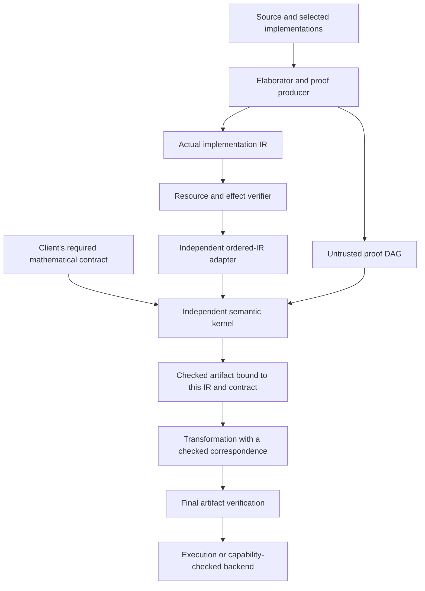

# Connecting meaning to implementation without whole-operator expansion

Status: **v0.1.3 research goal and experimental system design** (2026-09-27).
The user requested a first-principles design and the start of an independent,
semantics-focused implementation. This document specifies that architecture;
the [prototype record](../research/semantic-kernel/README.md) identifies the
implemented subset and its tests. It is not new `.qli` syntax, a new stable
Rust API, a generalized compiler, or a claim that v1 is achieved.

Subsequent scheduling decision (2026-09-27): retain this design and the initial
prototype. Further kernel development and production integration are
[future roadmap work](../ROADMAP.md#future-work-symbolic-semantic-kernel),
with no target release selected. The obligations below remain design and
proof requirements for that future work.

The existing finite [SC](semantic-contracts-v0.1.md) and
[FC](function-contracts-v0.1.md) contracts remain normative for the shipped
compiler. The six [imaginary algorithms](imaginary-v1/README.md) constrain this
design. In particular, dense logical multiplication is an architectural
blocker, as recorded in [R14](imaginary-v1/requirements.md#scaling-prerequisite-for-r14).

## 1. Start with the claim, not with its representation

A program author wants an implementation of a particular mathematical
operation. A checker must relate three independently identified objects:

1. The required meaning and its entry/exit conditions.
2. The actual implementation that will be lowered or executed.
3. A derivation establishing that the implementation realizes that meaning.

Extracting an operator from a circuit and naming it the specification only
establishes a self-equality. It does not establish the intended phase oracle,
QPE instrument, or arithmetic function. The client must fix the required
contract independently; an implementation provider supplies a witness and
evidence against that contract. Replacing the provider must preserve the
client's requirement.

Four facts must not be collapsed into one boolean:

| Judgment | What it establishes | What it does not establish |
| --- | --- | --- |
| Resource/effect validity | Every owned input/output is accounted for; operation effects and available capabilities are respected. | An encoded-state promise, exact cleanup, or algorithm correctness. |
| Semantic realization | The actual implementation satisfies the fixed typed contract, including phase and layout. | That a particular runtime input satisfies a restricted entry promise. |
| Entry establishment | The actual preparation or preceding checked step supplies the required encoded input. | A mathematical contract for an arbitrary subsequent implementation. |
| Algorithm claim | A specified composition meets its probability, error, arithmetic or task objective under its assumptions. | Compiler correctness or realization on noisy hardware. |

All judgments include the surrounding resources. Distinct owners need not
be in a product state. Proof objects and circuit descriptions are reusable
classical data; applying them consumes and returns quantum ownership.

## 2. Mathematical semantics and contract families

Let a finite typed interface A denote a Hilbert space H(A). `Unit` has
dimension one, not zero; its ownership and scalar phases survive. Product
types retain their tree and the convention that the left factor occupies
the low axes. An explicit checked coordinate transport accounts for
reassociation, layout changes and output permutations.

The denotation of a pure implementation is a linear map. It is legitimate
to describe this map mathematically by a matrix: **having matrix semantics
does not require materializing its entries in the checker**. Syntax, proof
terms and their denotations are different objects.

### Exact pure realization

Fix isometries `Ei:L_in->P_in`, `Eo:L_out->P_out`, and
`u:L_in->L_out`. For a well-formed physical implementation C with denotation U,

```text
Realizes(C, Ei, Eo, u)  means  U Ei = Eo u.
```

Physical isometry/unitarity is checked independently of this restricted
equation. The kernel constructs only known isometries and tracks which are
unitary; its first raw-IR adapter accepts only unitary implementations.
Encoding terms can be rectangular isometries. Equality is
exact, including phase. Source type trees, ownership holders and IR axes
must eventually be associated with these mathematical interfaces explicitly.

For every reference R, tensoring the equation with `I_R` preserves it. Thus
the claim applies to arbitrary correlated logical/reference inputs and, by
linearity, mixed states. A large identity frame is a symbolic constructor,
not a request to enumerate the reference's basis.

### Encoded entry and exact cleanup

At runtime the entry condition is a relation to an actual preparation/history,
for example a joint state of form `(Ei tensor I_R) rho (Ei† tensor I_R)`.
A theorem about Ei alone does not establish that condition. Initially,
fresh zero allocation or the output of an already checked contract should
establish it; there is no unrestricted `AssumeEncoded` operation.

For `E0|x>=|x,0_scratch>`, a checked equation `U E0=E0 v` proves that the
scratch is zero and separated at exit for every allowed input/reference.
The runtime may release it purely only when entry E0 was actually established
and the checked implementation is the one executed. An encoding expression
in a proof graph is not a runtime release capability. The first standalone
prototype proves encoded equations; the compiler's new entry/release path is
a separate integration gate, not implied by those equations.

### Contracts that are not pure intertwining

| Family | Required mathematical content | Operational consequence |
| --- | --- | --- |
| Projected block | `Eo† U Ei = A/alpha`, or a declared approximation, with full U unitary, normalization and input/output subspaces. A may be a contraction rather than an isometry. | Retain the physical output. This family alone grants neither deterministic application of A nor pure scratch release. |
| Instrument | Outcome-indexed CP maps `I_b` on the complete remaining system; their sum is TP. Include outcome interpretation, residual owners, zero-probability branches and failure outcomes. | Measurement consumes/rebinds resources according to the effect rules. Equivalence concerns the CP maps, not necessarily termwise equality of a chosen Kraus decomposition. |
| Approximation | A specified metric, target, error budget and composition rule. A controlled pure operation uses phase-sensitive operator error. An instrument may need a channel metric including references. | Approximation of logical accuracy does not weaken exact cleanup. Separate `U E0=E0 v` from `distance(v,u)<=epsilon`. |
| Host/algorithm | Sampling interface, classical validation, success/failure probability, bounded retries and exhaustion, with explicit arithmetic/input assumptions. | A simulator distribution is not a sample; period candidates and factors are checked before reporting success. |

These families remain distinct judgments, rather than variants that may be
implicitly coerced to exact pure evidence. The first kernel implements only
the exact pure family. QPE, Shor, walk and QSVT require later additions.

## 3. Architecture and trust direction



The producer can use AI, search, algebraic simplifiers, external solvers or
Lean to find evidence. Its result is untrusted until checked. No solver's
success flag, theorem name, source annotation or producer identity authorizes
execution or cleanup. The small kernel accepts only specified rules and
verified premises. A failed or exhausted proof check rejects evidence.

The independent implementation lives in
[`research/semantic-kernel`](../research/semantic-kernel/README.md), with
`publish=false`. It uses the existing IR data/verifier at the adapter boundary
and existing exact scalar arithmetic for bounded leaves. It does not reuse
frontend flattening or the whole-function dense equivalence checker as a
decision procedure. This is independence of checking paths, not a claim of
having no shared trusted code.

The existing compiler/executor continues to use its released finite boundary.
Research-package entry points do not introduce new source syntax, CLI commands,
production acceptance rules or evidence variants. Their promotion requires a
separate specification and compatibility review; new public functionality is
minor-release work under the [version policy](versioning.md).

## 4. Symbolic objects and checking rules

Use separate acyclic arenas for typed meanings and raw proof nodes. Each
reference must name an earlier node. Type/interface checking precedes use;
proof conclusions are derived from rules and then compared with the client's
expected root. The client fixes an immutable `RequiredContract` snapshot of
the meanings and implementation roots before handing proof construction to
an untrusted producer. Term IDs alone do not fix meaning in a mutable graph.
The producer may extend the graph but cannot rewrite the fixed prefix or
supply the missing meaning of a dangling required reference. The client is
responsible for choosing this requirement; a checker cannot infer intent from
a provider's self-selected specification. A private checked value retains
its checked graph and binding.
Reusing a node shares a derivation, not a quantum resource.

The initial semantic constructors include identity, phase-fixed sealed gates,
composition, low-axis-first tensor, zero insertion, qualified adjoint and
coherent control, and finite repetition. Layout transport and placement must be explicit. Constructor
names are research data structures, not proposed `.qli` spellings. The full
architecture also needs parameterized families; exact initial support is
listed in the prototype record.

Initially, matching means checked structural identity, with interning where
applicable. Equal dimension, equal image, a shared name, or an unchecked digest
is insufficient. Equivalent but differently written encodings or meanings
need an explicit checked equality/conversion rule in a subsequent profile.
An incomplete checker can reject a true claim; it must not accept an unknown
claim. General semantic equivalence is not delegated to an implicit simplifier.

| Rule | Semantic premises and derived conclusion |
| --- | --- |
| Identity | For a checked isometry E, derive `I_P E = E I_L`. |
| Bounded exact leaf | Interpret a small, well-typed implementation and encodings independently; establish isometry by checked constructors and compare every entry of `U Ei=Eo u` exactly, including leakage rows and phase. Bound the entire leaf, not just each primitive within it. |
| Sequence | From `U1 E0=E1 u1` and `U2 E1=E2 u2`, derive `(U2 U1)E0=E2(u2 u1)`. Require the same typed E1, including coordinates. Construct a composition node, not a matrix product. |
| Tensor/frame | Tensor both equations with the declared axis convention. This gives a claim on correlated inputs; it does not assume separability. The resource layer independently rejects aliased physical placement. |
| Adjoint | With U and u unitary, derive `U† Eo=Ei u†`. A rectangular logical isometry does not grant this rule. |
| Control | Initially require the same input/output E and known controllable physical implementation. Derive control of U and u with identity on the inactive branch, preserving exact phase. An unknown device's unitary specification does not supply controlled access. |
| Compute/uncompute theorem | If `Ef=C E0`, `W Ef=Ef u` and `C†C=I`, derive `C† W C E0=E0 u`. This is a Lean theorem and architectural rule; the first Rust proof format has no dedicated constructor for it. Its small example uses bounded exact checking. Runtime cleanup additionally needs established entry and exact implementation binding. |
| Finite repetition | Same exact interface/encoding at every iteration, static `u64` count, validated body even at count zero. Retain count and a derivation rather than unrolling during proof checking. Execution/circuit generation may have a different cost. |

The sequence argument is substitution plus associativity, not a new numerical
test. The [Lean rule ledger](lean-resource-proof.md) records the separately
mechanized mathematical statements. Those statements do not verify the Rust
implementation of this arena, leaf interpreter, adapter or proof checker.

## 5. Binding to source, transformations and execution

An evidence artifact must bind at least: the contract version and typed
interfaces; actual operation bodies; their dependency identities; entry/exit
encodings; ordered axis mapping; phase and effect; parameters; and the proof
root. Within an immutable graph, structural identity supplies exact binding.
A content hash can accelerate lookup but is not itself an equivalence proof.
Portable evidence will need a versioned parser and independently checked
reference resolution; the first prototype does not promise serialization.

The first adapter checks a documented subset of `RawProgram`. It independently
tracks ownership tokens to ordered axes after resource verification and records
output transport explicitly. Unsupported operations fail rather than becoming
identity. Preflight excludes legacy certificate paths that would invoke an
unrequested whole-operator matrix check. Its checked result retains the exact
raw snapshot. A changed implementation, control, target or output order requires
new checking even if the caller reuses its old name.

This is an IR boundary, not a proof of source lowering. Current raw shapes
erase the source type tree, and the public compiler primarily exposes closed
observing entry programs. General source integration needs a typed artifact
containing the source interface, elaboration witness, complete final raw IR,
dependency closure, and the correspondence between semantic nodes and actual
IR regions/axes. Matching source bytes is provenance, not source adequacy.

Each transformation must return both transformed IR and evidence relating it
to the previous required contract. A producer may introduce calls, change
layout, synthesize gates, or optimize a subterm only through a checked rule.
The final verifier checks the final artifact; checking an earlier AST and then
forgetting the evidence is insufficient. Backends must reject unavailable
control, measurement or exact-angle capabilities. Hardware noise is outside
the ideal contract unless a separately specified model is checked.

## 6. Scaling and honest cost boundaries

Checking must depend on the submitted type/term/proof graph and bounded leaf
work, not `2^n`-by-`2^n` matrices for an n-bit composite. The checker must
validate node references, types, widths, axis lists and budgets without first
expanding shared subgraphs. Width arithmetic and graph limits must be checked
before allocation. Deep adversarial graphs must not force recursive expansion.

Exact leaves are a deliberate bounded fallback. A large composite is rejected
as a leaf even when it contains only small gates; the producer must supply a
compositional derivation. A symbolic identity frame consumes no dense leaf
budget. Report checked nodes, leaf dimensions and exact work so tests can
detect accidental materialization. Bound the prototype independently of the
current six-bit contract profile without claiming unlimited checking.

This does not make arbitrary equivalence checking cheap or guarantee compact
proofs for every claim. General modular arithmetic requires reusable
parameterized algebraic/inductive proofs. Circuit construction, proof search,
proof checking and runtime execution have different costs; compact static
repetition cannot make exponentially many actual oracle calls inexpensive.

For the first generalized QPE profile, choose the angle domain and checking
method explicitly. Exact pi/8 phases lie outside the current eighth-root
arithmetic. Either extend the exact semantics and checker or specify an
approximate synthesis/error contract. Sized types alone resolve neither this
arithmetic issue nor the evidence representation problem.

## 7. Prior work and decisions drawn from it

The following are design comparisons, not imported proofs of Qleisli. No
third-party implementation has been copied into this prototype.

| Primary source | Relevant result | Qleisli decision and limit |
| --- | --- | --- |
| [SQIR/VOQC, A Verified Optimizer for Quantum Circuits](https://arxiv.org/abs/1912.02250) | Matrix denotations with symbolic reasoning at arbitrary width; verified transformations of an explicit IR. The paper also records extraction/translation trust boundaries. | Keep mathematical operator semantics while checking symbolic derivations. Preserve exact phase: the paper's phase-insensitive optimizer equivalence is not a sufficient replacement rule under Qleisli coherent control. |
| [QWIRE: A Core Language for Quantum Circuits](https://rand.cs.uchicago.edu/publication/paykin-2017-qwire/) | Separates a linear circuit language from a classical host and gives density-matrix semantics. | Separate reusable operation descriptions and proofs from linear resource ownership. Keep host execution and observation semantics explicit. Its results do not establish Qleisli source/IR correspondence. |
| [Linear Dependent Type Theory for Quantum Programming Languages](https://arxiv.org/abs/2004.13472) | Models linear dependent types and parameter-indexed circuit families. | Treat static sizes and operation parameters as typed interfaces to families, while requiring separate semantic evidence for the realized operation. No wholesale type-system adoption is decided here. |
| [Proving Quantum Programs Correct](https://arxiv.org/abs/2010.01240) | Mechanized SQIR algorithm proofs include QPE and Grover. | Build reusable algorithm derivations in addition to structural resource checks. Existing finite regressions are not proofs of Qleisli algorithm families. |

## 8. Delivery and subsequent gates

| Gate | Required artifact or evidence | Status boundary |
| --- | --- | --- |
| G013-S0: system design | This design, contract-family separation, trust/cost boundaries, literature decisions and compatibility disposition. | Completed design artifact; not whole-system implementation. |
| G013-S1: independent exact-pure slice | Raw term/proof DAG checking; fixed requested contract; direct and auxiliary implementations; actual raw-IR binding; large symbolic frame. | Initial subset implemented; validation and rejection evidence recorded in the prototype README. No new source acceptance. |
| G013-S2: semantic checks | General Lean rule lemmas plus independent small exact counterexamples and mutation tests. | Local rule proofs and regressions implemented and checked; the final release record states counts/toolchains. Checker adequacy remains open. |
| G013-S3: production source integration | Typed source artifacts, entry establishment, certified release, transformation witnesses, and final-IR checking on actual compiled programs. | Subsequent specification/implementation; not completed by an IR-only adapter. |
| Generalized algorithms | Parameterized arithmetic, QPE angle/error profile, instruments, sampling/retries, and V1-C1–C5. | Future work; neither version selection nor symbolic identity frames satisfy v1. |

First-slice acceptance includes phase mismatch, wrong middle encoding,
nonunitary adjoint, invalid control premises, stale IR, axis/ownership errors,
cyclic or forward proof references, false roots and budget exhaustion. It
also checks a large identity frame while bounding every exact leaf. General
Rust soundness, primitive/interpreter adequacy, source lowering and backend
correctness remain explicit obligations after these tests pass.
